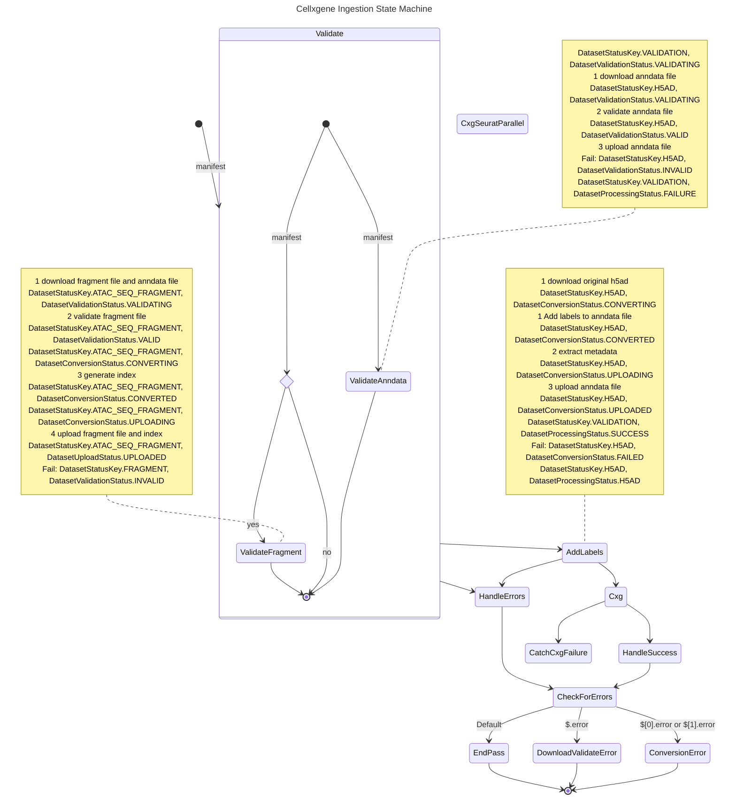

NEW

The initial strate of the state machine is as follows:

- DatasetUploadStatus.WAITING
- DatasetProcessingStatus.INITIALIZED

Useful States:

- ingestion Initialized
- ingest
- Validating
- Invalid
-
