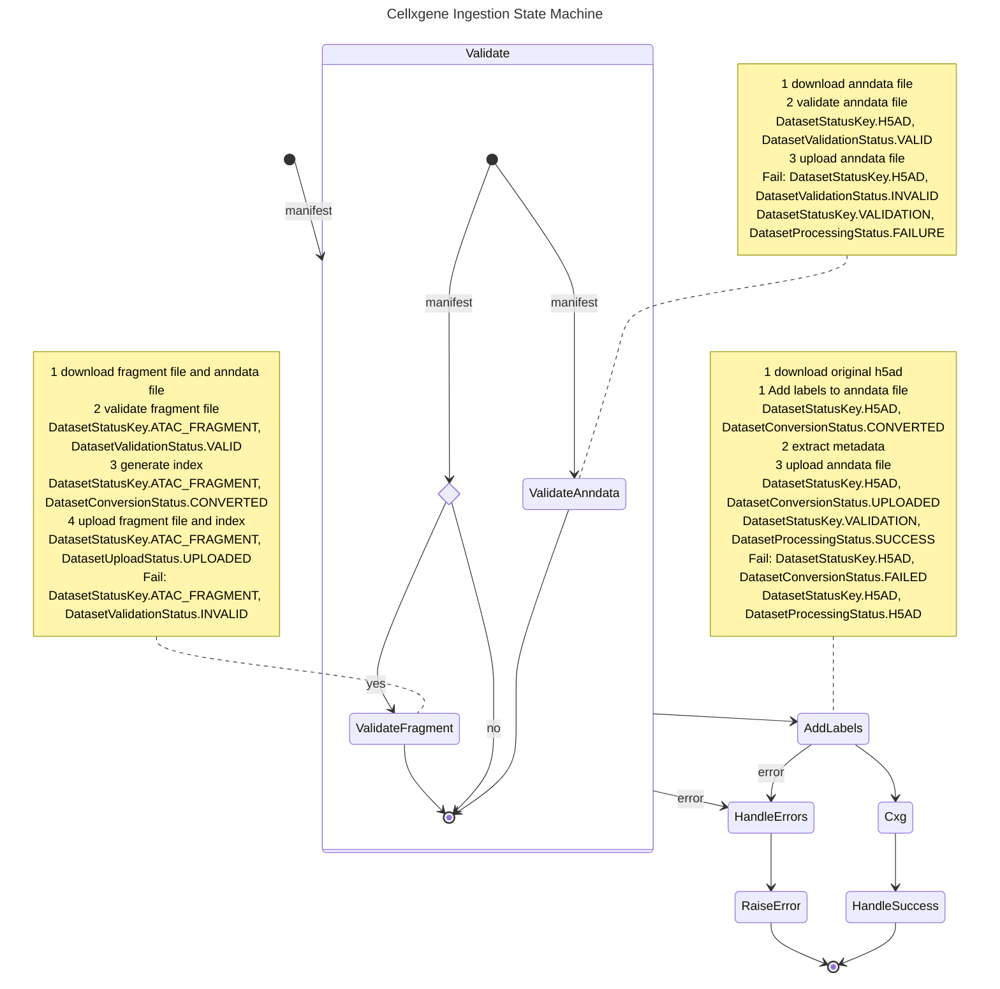

The initial strate of the state machine is as follows:

- DatasetUploadStatus.WAITING
- DatasetProcessingStatus.INITIALIZED

This is a diagram of the current AWS Step Function

```mermaid
---
title: Cellxgene Ingestion State Machine
---
stateDiagram-v2
    Validate: Validate
    ValidateAnndata: ValidateAnndata
    note left of ValidateAnndata
        1 download anndata file
        2 validate anndata file
        DatasetStatusKey.H5AD, DatasetValidationStatus.VALID
        3 upload anndata file
        Fail: DatasetStatusKey.H5AD, DatasetValidationStatus.INVALID
            DatasetStatusKey.VALIDATION, DatasetProcessingStatus.FAILURE
    end note
    ValidateFragment: ValidateFragment
    note left of ValidateFragment
        1 download fragment file and anndata file
        2 validate fragment file
        DatasetStatusKey.ATAC_FRAGMENT, DatasetValidationStatus.VALID
        3 generate index
        DatasetStatusKey.ATAC_FRAGMENT, DatasetConversionStatus.CONVERTED
        4 upload fragment file and index
        DatasetStatusKey.ATAC_FRAGMENT, DatasetUploadStatus.UPLOADED
        Fail: DatasetStatusKey.ATAC_FRAGMENT, DatasetValidationStatus.INVALID
    end note
    AddLabels: AddLabels
    note left of AddLabels
        1 download original h5ad
        1 Add labels to anndata file
        DatasetStatusKey.H5AD, DatasetConversionStatus.CONVERTED
        2 extract metadata
        3 upload anndata file
        DatasetStatusKey.H5AD, DatasetConversionStatus.UPLOADED
        DatasetStatusKey.VALIDATION, DatasetProcessingStatus.SUCCESS
        Fail: DatasetStatusKey.H5AD, DatasetConversionStatus.FAILED
              DatasetStatusKey.H5AD, DatasetProcessingStatus.H5AD
    end note
    HandleSuccess: HandleSuccess
    HandleErrors: HandleErrors
    Cxg: Cxg

    [*] --> Validate: manifest
    state Validate {
        [*] --> ValidateAnndata: manifest
        ValidateAnndata --> [*]
        state hasFragment <<choice>>
        [*] --> hasFragment: manifest
        hasFragment --> ValidateFragment: yes
        hasFragment --> [*]: no
        ValidateFragment --> [*]
    }
    Validate --> AddLabels
    AddLabels --> Cxg
    Cxg --> HandleSuccess
    HandleSuccess --> [*]
    Validate --> HandleErrors: error
    AddLabels --> HandleErrors: error
    HandleErrors --> RaiseError
    RaiseError --> [*]
```
