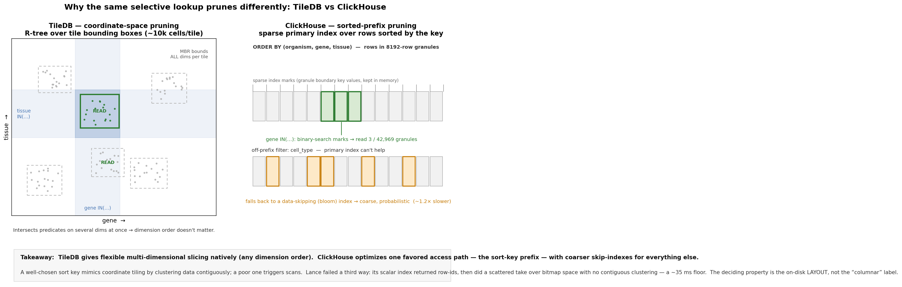

# ClickHouse vs TileDB — architectural differences (for the WMG cube)

Background for the WMG cube storage spikes: see
[`STORAGE_SPIKE_TECHNICAL_SUMMARY.md`](STORAGE_SPIKE_TECHNICAL_SUMMARY.md) (the synthesis) and
[`WMG_CUBE_TILEDB_EXIT_REWORK.md`](WMG_CUBE_TILEDB_EXIT_REWORK.md) (the cube-exit plan). This doc
explains *why* the two engines behave the way the benchmarks showed — the architecture underneath the
numbers. Both store large analytical data and both prune to avoid full scans, but they rest on
fundamentally different data models.

---

## The one difference everything follows from

**TileDB is a sparse multi-dimensional array. ClickHouse is a sorted columnar table.** That root
choice dictates how each one prunes, and every contrast below is downstream of it.

- **TileDB** addresses data by **coordinates in an N-dimensional space**. For the WMG cube the
  dimensions are `(gene, tissue, organism)`; each stored cell sits at a coordinate and carries the
  attributes (`sum`, `sqsum`, `nnz`, plus the non-indexed filter columns). It prunes in **coordinate
  space**.
- **ClickHouse MergeTree** is a flat relational table whose rows are kept **sorted by one linear key**
  (the `ORDER BY`). It prunes along **that single sort order**.

So the axis is: *multi-dimensional coordinate index* vs *one linear sort key*.

---

## How each one prunes (the load-bearing mechanic)

**TileDB — R-tree over tile bounding boxes.** Sparse cells are sorted into tiles of ~10,000 cells
(`capacity=10000`); each tile records a **minimum bounding rectangle (MBR)** over *all* dimensions at
once. A query like `gene IN (…) AND tissue IN (…)` does a spatial lookup in the R-tree for tiles whose
MBR overlaps both ranges and reads only those. The key property: it intersects predicates on **several
dimensions simultaneously**, because each tile is bounded in every dimension. Dimension *order* barely
matters — selective access works on any combination.

**ClickHouse — sparse primary index over a sorted prefix.** Rows are physically sorted by the key and
split into 8192-row **granules**; an in-memory index holds the key value at each granule boundary.
`WHERE <key-prefix> IN (…)` **binary-searches** those marks to find matching granule ranges and reads
only those column blocks. But this works well only for a **prefix** of the sort key. That is why the
`ORDER BY (organism, gene, tissue)` choice was load-bearing in the spike: `organism + gene` is the
prefix, so gene lookups prune to **3 of 42,969 granules**. A predicate on a column *not* in the prefix
(e.g. `cell_type`) can't use the primary index — it falls back to a coarser **data-skipping index**
(the bloom filters added in `wmg_build_chdb.py`), which prunes at granule granularity,
probabilistically. That is exactly why `genes + cell_types` was the one shape ~1.2× slower.

**The takeaway:** TileDB gives any-dimension selective slicing for free; ClickHouse gives one favored
access path (the sort prefix) plus coarse skip-indexes for everything else. This is the same axis on
which Lance lost — its scalar index returned row-ids but then did a scattered take (row-id/bitmap
space) with no contiguous clustering, hence its ~35 ms floor. A well-chosen ClickHouse sort key makes
prefix pruning behave enough like coordinate tiling to match TileDB; a poorly-chosen one degrades to a
scan.

---

## Sparsity

The cube is sparse — most `(gene, tissue, organism, …)` combinations don't exist. **TileDB is natively
sparse**: it stores only non-empty cells with explicit coordinates and has a real notion of a
dimension domain with holes. **ClickHouse has no sparsity concept** — it's a dense row table; the
cube's sparsity is simply "the rows that happen to exist." For an *already-aggregated* cube (existing
group → summary rows) that's a non-issue: it's just 351M materialized rows. Sparsity would matter far
more for the raw cell×gene tensor — which is why native sparsity is decisive for the Explorer
`.cxg`/corpus (tensor → Zarr) but nearly moot for the OLAP cube.

---

## Library vs query engine

- **TileDB is a storage library, not a query engine.** It offers dimension slicing + attribute
  conditions and returns Arrow/pandas. No SQL, no `GROUP BY`, no joins — the WMG code does aggregation
  and rollup in pandas after the read.
- **ClickHouse is a full vectorized SQL OLAP engine** — aggregation, joins, functions, parallel
  execution across granules and cores. The cube's point-lookups use a sliver of that (a filtered
  projection), but the rest is latent upside: it *could* do server-side aggregation, unify the 7
  arrays, or express the diffexp `group_id` logic in SQL. TileDB can't; that logic lives in Python.

---

## Execution & concurrency model

- **TileDB** reads tiles, parallelizes tile reads with its own thread pool, runs embedded in-process,
  and bounds its per-process tile cache by `sm.tile_cache_size` (50% of VM in `create_ctx`).
- **chDB (embedded ClickHouse)** runs vectorized, multi-threaded query execution (parallel granule
  scans), embedded in-process, with its **own** caches (mark cache, uncompressed cache) *per process*.
  That "per-process caches × N workers" is the memory risk, and a native blocking query call that
  can't yield to gevent is the tail-latency risk — both under test in
  `scripts/wmg_chdb_spike_concurrency.py`.

---

## Write / ingest & storage size

- **TileDB**: write cells, then `consolidate` + `vacuum` to merge fragments. Aggressive filters —
  dictionary+zstd-19 on the ascii dims, byteshuffle+zstd-5 on numerics — got the cube to **7.6 GB**.
- **ClickHouse**: `INSERT` creates parts; a background **merge** keeps them sorted (the "MergeTree"
  name). Fast ingest (~183 s for 351M rows), but the spike's table used plain `String` columns, so it
  landed at **~17 GB**. That's tunable — `LowCardinality(String)` on the categorical ontology-ID dims
  plus codec tuning would close much of the gap, since those columns are exactly what dictionary
  encoding targets.

---

## Deployment shape (why *embedded* ClickHouse)

- **TileDB**: a directory of files, synced from S3, opened in-process (or read straight from S3 via
  VFS). No server.
- **ClickHouse server**: an always-on service needing a DB restore — breaks the "sync a dir from S3"
  snapshot model.
- **chDB embedded**: in-process over a local directory, just like TileDB — the whole reason it's the
  candidate. It gets ClickHouse's granule-skipping *without* the operational-model change.

---

## The selection criterion is the layout, not "columnar"

It's tempting to read this as "we picked a columnar DB, so the field is open to other columnar DBs."
It isn't — the criterion that decided the spike is a **storage-layout** property, not a data-model
label: *does the on-disk layout physically cluster the leading dims so a selective lookup is a
contiguous slice, not a scan?*

Most columnar OLAP engines are **scan-first** — built for large aggregations, leaning on min/max
zonemaps + brute parallel scan. That's why two *columnar* candidates lost: DuckDB (ART index unused
for `IN`-lists, planner preferred scans) and Lance (index returned row-ids but data wasn't clustered →
scattered take, ~35 ms floor). ClickHouse won not because it's columnar but because **MergeTree keeps
rows sorted by a key with a sparse primary index that prunes on the key prefix** — a design choice
most columnar stores *don't* make. So the relevant category is the narrower "**sorted/clustered store
with a sparse primary/prefix index**," not "columnar DB."

Other engines that share that pruning property — StarRocks, Apache Doris, Pinot, Druid — are
**distributed clusters**, a much heavier operational jump than WMG's "sync a dir from S3, no server"
model. ClickHouse is distinctive in spanning embedded (chDB, for building), single-node sidecar (for
serving), and read-only static files from S3 (the web disk) — it fits the existing deployment shape.
So further engine evaluation, if a driver ever warrants it, should apply the *pruning-layout* test
(cheap, behind the `CensusCubeQuery` seam), not shop by "columnar." Absent a driver to consolidate
onto an already-run platform, another candidate would likely re-confirm ClickHouse, not beat it.

## Single sort order vs coordinate tiling (access-pattern flexibility)

The real semantic difference from TileDB — and the one limit to design around — is not "columnar" (that
just means projecting few columns reads less, a benefit). It's that ClickHouse gives **one favored
access path: the sort-key prefix.** TileDB's R-tree bounds *all* dimensions per tile, so it slices
selectively on **any** dimension combination with no favored order. ClickHouse forces you to commit to
a primary sort; a predicate leading with a non-prefix column falls back to a coarser skip-index or a
scan. We saw it directly: `ORDER BY (organism, gene, tissue)` made gene lookups fly, but the
`genes + cell_types` shape was the one that ran ~1.2× slower — `cell_type` is off-prefix, served by a
bloom skip-index.

ClickHouse's answer to multiple access patterns is **multiple sort orders**: `PROJECTION`s (a table
maintaining an alternate `ORDER BY` automatically) or separate tables / materialized views. Crucially
**WMG already works this way** — it's seven purpose-built arrays (`expression_summary`, `_default`,
`cell_counts`, `marker_genes`, and the `group_id`-keyed diffexp cubes), each denormalized for one
access pattern; the chDB build mirrors that (one table per cube, each with its own optimal `ORDER BY`
— diffexp sorts by `group_id`, not gene). So "organize the data per access pattern" is *already the
WMG design*, and ClickHouse fits it natively.

Where it would bite: if the API grew toward **arbitrary ad-hoc queries over unpredictable dimension
combinations**, a single sort order per table couldn't cover them — you'd maintain many projections
(storage blowup) or accept scans. WMG's API is the opposite: a small, enumerable, gene-/group-centric
set of shapes, all coverable by a couple of sort orders. Net: ClickHouse trades TileDB's
access-pattern-agnostic coordinate model for a "pick your sort order(s)" model — the right trade *given*
WMG's known, few, per-pattern-organized access patterns; a poor one if the workload became open-ended
ad-hoc analytics.

---

## One-paragraph summary

TileDB indexes a **sparse multi-dimensional coordinate space** and slices selectively on any dimension
combination via an R-tree over tile bounding boxes — great for "these few genes in these tissues" with
no favored order. ClickHouse indexes a **single linear sort order** over a dense columnar table and
prunes granules by binary-searching a sparse primary index on the sort-key *prefix*, backed by coarse
skip-indexes for off-prefix columns — so it needs the right `ORDER BY`, but in exchange gives you a
real SQL engine. For WMG's already-aggregated, gene-selective point-lookups, a well-chosen sort key
makes ClickHouse's prefix pruning behave enough like TileDB's coordinate tiling to match or beat it —
which is what the spike showed. The remaining question is purely operational (memory + concurrency
across workers), not about the pruning model.
