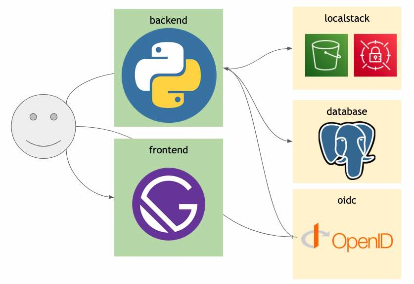

# Local Development Environment

## Install Docker

1. [install docker](https://docs.docker.com/get-docker/). If brew is installed run `brew install docker`. If you have a Mac, [install Docker Desktop](https://www.docker.com/products/docker-desktop) and open it so it's running on your machine. Note: If you have a Mac M1 (arm64 CPU), follow instructions in [`docker-compose.yml`](docker-compose.yml) under `oidc` service, for manually building the oidc-server-mock images for the M1 architecture.

## Development quickstart

1. From the root of this repository, run `make local-init` to build and run the dev environment. The first build takes awhile, but subsequent runs will use cached artifacts. Note: If Docker reports a conflict for port 5000, and you are on a Mac, you should turn off Control Center's "Airplay Receiver" in the "Sharing" System Preferences ([details](https://developer.apple.com/forums/thread/682332)).
1. Visit [https://localhost:5000](https://localhost:5000) to view the backend, and [https://localhost:3000](https://localhost:3000) for the frontend.
1. `make local-dbconsole` starts a connection with the local postgresql db.
1. **Open the source code and start editing!**

- Modify code in the `frontend/src` directory, save your changes and the browser will update in real time.
- Modify code in the `backend` directory, and the data portal api will reload automatically.

### OAuth creds

Username: User1 / Password: pwd ([users are defined here](oauth/users.json))

### Containers managed by the dev environment

The data portal dev environment is a set of containers defined in [docker-compose.yml](docker-compose.yml). The [backend docker image](Dockerfile.backend) and [frontend docker image](frontend/Dockerfile) are built locally. Update any of these files as necessary and run `make local-sync` to sync your dev environment with these configs.

### Updating frontend/backend dependencies

Both the data portal frontend and backend services will automatically reload when their source code is modified, but they won't automatically rebuild when their dependencies (such as npm or pip package lists) change.

To update the dev env to reflect changes to [frontend/package.json](frontend/package.json) or [backend/api_server/requirements.txt](backend/api_server/requirements.txt), run `make local-sync`

### Update Dev Data

The dev environment is initialized with AWS Secrets/S3 data in the [scripts/setup_dev_data.sh](scripts/setup_dev_data.sh) script, as well as DB data from [tests/unit/backend/fixtures/test_db.py](tests/unit/backend/fixtures/test_db.py). To add more data, modify these scripts and run `make local-init` to reload the dev environment's data stores.

### Make targets for managing dev:

| Command                                            | Description                                                                        | Notes                                                                                                                                                                                                                                                                                                                                                                                                                                                                                                                                                                                                                                                                                       |
| -------------------------------------------------- | ---------------------------------------------------------------------------------- | ------------------------------------------------------------------------------------------------------------------------------------------------------------------------------------------------------------------------------------------------------------------------------------------------------------------------------------------------------------------------------------------------------------------------------------------------------------------------------------------------------------------------------------------------------------------------------------------------------------------------------------------------------------------------------------------- |
| `make local-init`                                  | Launch a new local dev env and populate it with test data.                         |                                                                                                                                                                                                                                                                                                                                                                                                                                                                                                                                                                                                                                                                                             |
| `make local-start`                                 | Start a local dev environment that's been stopped.                                 |                                                                                                                                                                                                                                                                                                                                                                                                                                                                                                                                                                                                                                                                                             |
| `make local-stop`                                  | Stop the local dev environment.                                                    |                                                                                                                                                                                                                                                                                                                                                                                                                                                                                                                                                                                                                                                                                             |
| `make local-dbconsole`                             | Connect to the local database.                                                     |                                                                                                                                                                                                                                                                                                                                                                                                                                                                                                                                                                                                                                                                                             |
| `make local-logs`                                  | Tail the logs of the dev env containers.                                           | Run `make local-logs CONTAINER=backend` to tail the logs of a specific container. Dev containers are: backend, frontend, localstack, database, oidc                                                                                                                                                                                                                                                                                                                                                                                                                                                                                                                                         |
| `make local-shell CONTAINER=frontend`              | Open a command shell in one of the dev containers                                  | Dev containers are: backend, frontend, localstack, database, oidc                                                                                                                                                                                                                                                                                                                                                                                                                                                                                                                                                                                                                           |
| `make local-status`                                | Show the status of the containers in the dev environment.                          |                                                                                                                                                                                                                                                                                                                                                                                                                                                                                                                                                                                                                                                                                             |
| `make local-clean`                                 | Remove everything related to the local dev environment (including db data!)        |                                                                                                                                                                                                                                                                                                                                                                                                                                                                                                                                                                                                                                                                                             |
| `make local-sync`                                  | Re-sync the local-environment state after modifying library deps or docker configs |                                                                                                                                                                                                                                                                                                                                                                                                                                                                                                                                                                                                                                                                                             |
| `make local-smoke-test`                            | Run e2e-smoke tests in local dev                                                   |                                                                                                                                                                                                                                                                                                                                                                                                                                                                                                                                                                                                                                                                                             |
| `make local-unit-test-backend <path=path_of_test>` | Run backend unit tests in local dev                                                | To run one or more or all backend tests. If path is not specified it will run all backend tests  examples:   1. `make local-unit-test` run all backend tests   2. `make local-unit-test-backend path=tests.unit.backend.api_server.test_v1_collection_upload_link` run all tests in the specified module   3. `make local-unit-test-backend path=tests.unit.backend.api_server.test_v1_collection_upload_link.TestCollectionUploadLink` run all tests in the specified class   4. `make local-unit-test-backend path=tests.unit.backend.api_server.test_v1_collection_upload_link.TestCollectionUploadLink.test__cancel_dataset_download__ok` run specified single test |
| `make local-uploadjob`                             | Run dropbox upload task                                                            | ex: `make local-uploadjob DATASET_ID=xxxxxx DROPBOX_URL="https://www.dropbox.com/asdfasdf?dl=0"`                                                                                                                                                                                                                                                                                                                                                                                                                                                                                                                                                                                            |

### Make targets for running tests in dev

| Command                               | Description                                                                                  | Notes |
| ------------------------------------- | -------------------------------------------------------------------------------------------- | ----- |
| `make local-unit-test`                | Run backend tests in the local dockerized environment, against mock of persistence layer     |       |
| `make local-integration-test-backend` | Run backend tests in the local dockerized environment, against dockerized database instance. |       |
| `make local-unit-test-processing`     | Run dataset processing upload job unit tests in the 'processing' docker environment.         |       |
| `make local-unit-test-wmg-backend`    | Run wmg backend unit tests in the local dockerized environment.                              |       |
| `make local-functional-test`          | Run backend functional tests in local dockerized environment                                 |       |
| `make local-smoke-test`               | Run frontend/e2e tests in the local dockerized environment                                   |       |

### External dependencies

The dev environment has no network dependencies, but it launches some extra containers to mock external dependencies:

- [LocalStack](https://github.com/localstack/localstack) to mock AWS
- [OIDC server mock](https://github.com/Soluto/oidc-server-mock) in place of Auth0.
- [postgres](https://hub.docker.com/_/postgres) in place of RDS.

#### TLS Certificate for mock authentication service

Due to browser security considerations, we must run the mock authentication
service using a self-signed certificate. The local-init and local-clean make targets
handle managing a keypair/certificate for each dev env and installing it in the
OSX system keychain.

Details: OIDC requires setting a token, and requires the cookie storing that
token to be stored with samesite=None to work properly. Recent versions of
browsers such as Chrome intentionally only allow samesite=None if the connection
is over a secure network connection i.e. TLS. Thus we need to run even a local
development auth service behind a certificate. We bundle a pre-generated
self-signed cert in for convenience.
