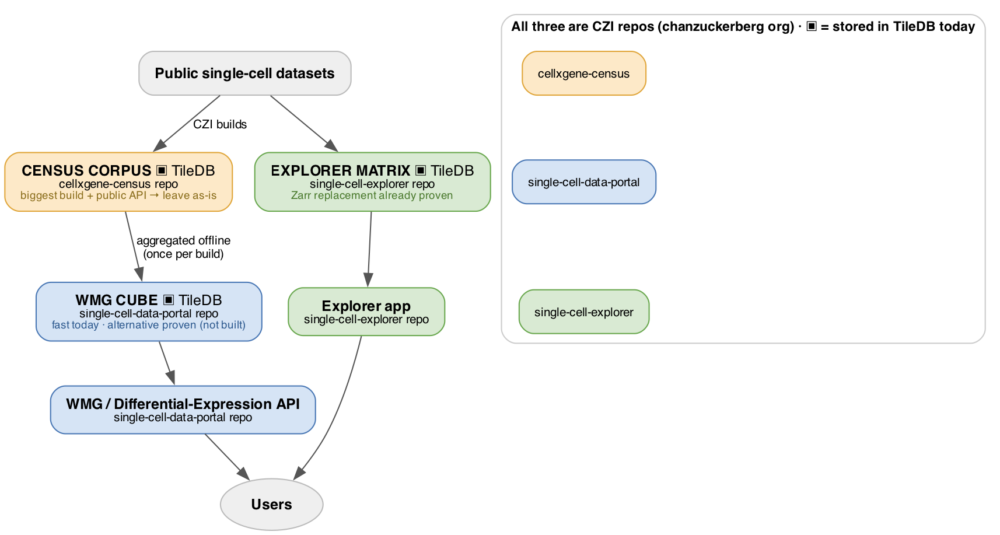

# Can we move off TileDB? — findings for product

*A de-risking investigation into whether the single-cell platform can move off TileDB, its
foundational storage technology. Research spike, mid-2026 — read time ~4 min.*

## TL;DR

- **Nothing needs doing now.** Every part of the platform meets its performance targets on TileDB
  today.
- **We de-risked our options.** For each part of the system we now know the path — and the rough
  cost — to move off TileDB *if* we ever need to.
- **A full move would be one CZI program across three components** (three CZI repos). The Census
  piece is the heaviest and is shared with the outside research community, so it's a cross-team
  effort — not something one team flips on its own.

## Why we looked

TileDB is the storage engine under three parts of our stack. Moving off it isn't required today — we'd
only do it if we chose to drop that heavy, specialized dependency, or if the org adopted a more open,
"cloud-native" storage standard. Before any such decision, we wanted to know: **is leaving even
possible, and what would it cost?** This was a research spike to buy that certainty, not a migration.

## The system at a glance

*Three components store their data in TileDB today (▣). All three live in CZI repos. Users reach the
platform through the WMG / Differential-Expression API and the Explorer app — and the WMG cube is
built from the Census corpus, which is also a public dataset used by researchers worldwide.*

## What we found — three parts, three answers

| Component | Where it lives (CZI) | Works today? | Can it move off TileDB? | Effort if we do it |
|---|---|---|---|---|
| **Explorer matrix** — data behind the cell viewer | single-cell-explorer | 🟢 yes | 🟢 Modern replacement proven | Low–Medium |
| **WMG cube** — powers Where's My Gene + Diff-Expr | single-cell-data-portal | 🟢 fast | 🟢 Replacement approach validated (not built) | Medium |
| **Census corpus** — the source dataset the cube is built from | cellxgene-census | 🟢 yes | 🟡 Feasible; heaviest & shared | Large (cross-team + public) |

- **Explorer matrix** — the per-dataset data behind the cell viewer. We proved a modern, open-format
  replacement works.
- **WMG cube** — powers "Where's My Gene" and Differential Expression. Fast on TileDB today; we found
  and validated a replacement approach that matches its speed, but haven't built it (no reason to yet).
- **Census corpus** — the large, harmonized dataset the cube is built from. It's produced by a
  different CZI team and is *also a public product* used by researchers worldwide. We're one consumer
  of it, so changing its format is a shared, cross-team decision with the widest impact.

## What a move would take (only if we decide to)

One program, three workstreams, in order of how independently we can do them:

- **Explorer + WMG cube** — ours to do; medium effort each; the paths are already proven.
- **Census corpus** — the heavy one, with two flavors:
  - *If the goal is just to remove the dependency from our own services:* we can do that on our side
    without changing the Census, at the cost of taking on some data-preparation work ourselves.
  - *If the goal is that the Census itself stops using TileDB:* that's a large, shared effort with the
    Census team — it's a huge weekly build and a public API — best done as a new open-standard storage
    backend that keeps every existing user working.
- **Removing TileDB *entirely* needs all of these together** — no single change does it.

## Recommendation

**Keep TileDB today.** Nothing forces a change and everything performs. The value of this work is
**optionality**: if a driver appears, we know the path and rough cost per component instead of starting
from research. **Revisit if:** (a) we decide to drop the specialized dependency for operational
reasons, or (b) the org adopts a cloud-native storage standard.

## Go deeper (technical detail)

Full scoping and evidence in the detailed docs:
[Overview](STORAGE_SPIKE_OVERVIEW.md) ·
[Findings & evidence](STORAGE_BACKEND_MIGRATION_FINDINGS.md) ·
[Cube exit rework](WMG_CUBE_TILEDB_EXIT_REWORK.md) ·
[Engine architecture](CLICKHOUSE_VS_TILEDB_ARCHITECTURE.md) ·
[Census corpus scope](CENSUS_CORPUS_GENERATION_SCOPE.md)

*For the curious: the validated cube replacement is embedded ClickHouse (served via a ClickHouse
sidecar); the open corpus standard is SOMA over Zarr/Arrow. Specifics are in the linked docs.*
