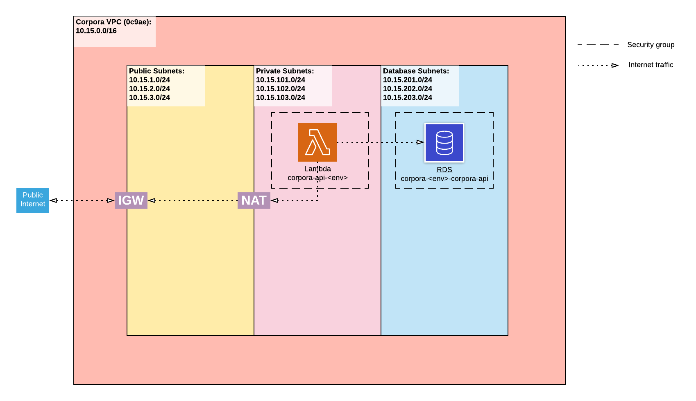

# Security Architecture

Corpora's infrastructure is managed by the [single-cell-infra repo](https://github.com/chanzuckerberg/single-cell-infra)
which was provided by the Shared Infrastructure team in order to enable streamlined creation of secure cloud
environments. This document depicts the application of the template environment in Corpora to illustrate its inner
complexities. In the future, general documentation on the
[cloud-env environment](https://github.com/chanzuckerberg/single-cell-infra/tree/main/terraform/envs/dev/cloud-env)
should be created by Shared Infrastructure to supplement and/or replace this doc.

## Illustration

The following diagram renders the VPC, subnets, security groups, internet gateway, network address translation
and their relationships provided by Shared Infrastructure's `cloud-env` environment. Additionally, Corpora-specific
resources such as the API Lambda and RDS cluster are contextualized against the security infrastructure. 

[LucidChart](https://app.lucidchart.com/invitations/accept/1f369f01-7d52-4fda-9323-dc018224db3b)

### VPC

[AWS documentation: VPCs](https://docs.aws.amazon.com/vpc/latest/userguide/what-is-amazon-vpc.html)

`cloud-env` exports one VPC per "project" per deployed environment. Single-cell (abbr. `sc`) is our project, and thus,
Corpora shares its VPC with cellxgene under the VPC name `sc-<ENV>`. All application resources must be deployed within
the project VPC. The CIDR block for the Corpora VPC is 10.15.0.0/16.

### Subnets and route tables

[AWS documentation: Subnets](https://docs.aws.amazon.com/vpc/latest/userguide/how-it-works.html#how-it-works-subnet)

[AWS documentation: Route tables](https://docs.aws.amazon.com/vpc/latest/userguide/VPC_Route_Tables.html)

The IP addresses in the VPC are further organized into three subnet groups: public, private and database. Each group
enables distinct internet traffic via association with a route table. For example, resources in the public subnet are
granted access to the public internet (via a route to the Internet Gateway resource), whereas the database subnet only
enables traffic within the VPC (via a route to the VPC CIDR block 10.15.0.0/16). All subnet groups' route tables define 
a route to the VPC CIDR block.

_Note: route tables are not represented in the diagram._

### Security groups

[AWS documentation: Security groups](https://docs.aws.amazon.com/vpc/latest/userguide/VPC_SecurityGroups.html)

Security groups provide fine control over resource access. Access is defined by a set of inbound and outbound traffic
rules that are applied to the security group. For application resources, it is best practice to create a security group
per resource as demonstrated by the Lambda and RDS. To illustrate, the Lambda security group defines a rule to allow all
outbound traffic and the RDS security group defines a rule to allow all inbound traffic from within the Corpora VPC.

### Internet Gateway (IGW) and Network Address Translation (NAT)

[AWS documentation: Configuring a private subnet with internet access](https://docs.aws.amazon.com/vpc/latest/userguide/VPC_Scenario2.html)

These resources are required to enable public internet access from both the public and private subnets within the VPC.
See the linked scenario for more information.
