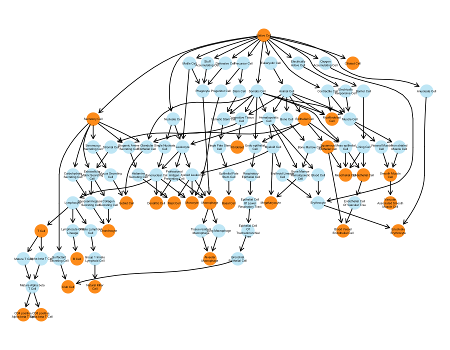

# Cell type ontology ordering

Cell types in a dot plot can be ordered using lineage information to maximize the utility of scExpression for pattern discovery and readability. The cell ontology (CL) directed acyclic graph (DAG) provides a good approximation to biological lineages. Thus we have a developed a method to create an ordered list of cell types based on the information contained in the CL DAG.

The method traverses the DAG starting from the root until reaching the leftmost bottom node adding nodes present in the data along the way. Once it reaches the bottom, it recursively repeats the process for any siblings. After, it traverses back and repeats the sibling process until exhaustion.

## Algorithm

1. Load the CL ontology, using either the cl.obo or cl.owl from the source file [here](https://github.com/obophenotype/cell-ontology/releases/tag/v2021-08-10).
1. Subset the ontology to only contain the cell types of interest along with their ancestors.
1. Create a 2-dimensional representation of the DAG using the `dot` method of `graphiz`. See [here](http://www.graphviz.org/pdf/dotguide.pdf) for a full description of this method.
1. Traverse the tree starting at the root:
	1. If node is present in cell types of interest, add to the final ordered list.
	1. Remove the node from nodes of interest.
	1. Get children nodes
	1. Perform recursion for each child node, going left-to-right through the children nodes. 
1. Return the ordered list

## Example

The following is an example of how a subset of the CL DAG looks like when rendering it with the `dot` algorithm from `graphiz`. Orange nodes represent cell types that would be present in the data corpus and are the target labels to be ordered.

 

    
 

The cell type ordering algorithm described above would return the following ordered list of cell types.

* Native Cell
* Secretory Cell
* Club Cell
* Chondrocyte
* Goblet Cell
* Mast Cell
* T Cell
* CD4 positive, Alpha beta T Cell
* CD8 positive, Alpha beta T Cell
* B Cell
* Natural Killer
* Dendritic Cell
* Monocyte
* Macrophage
* Alveolar Macrophage
* Basal Cell
* Fibroblast
* Megakaryocyte
* Enucleate Erythrocyte
* Myofibroblast Cell
* Mesothelial Cell
* Endothelial Cell
* Blood Vessel Endothelial Cell
* Smooth Muscle Cell
* Vascular Associated Smooth Muscle Cell
* Epithelial Cell
* Squamous Epithelial Cell
* Ciliated Cell

