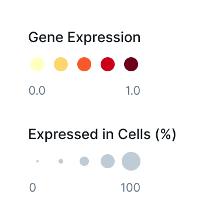
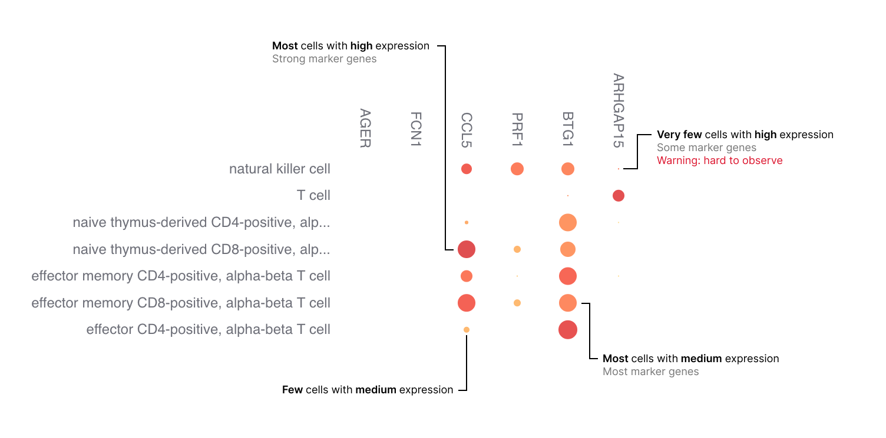
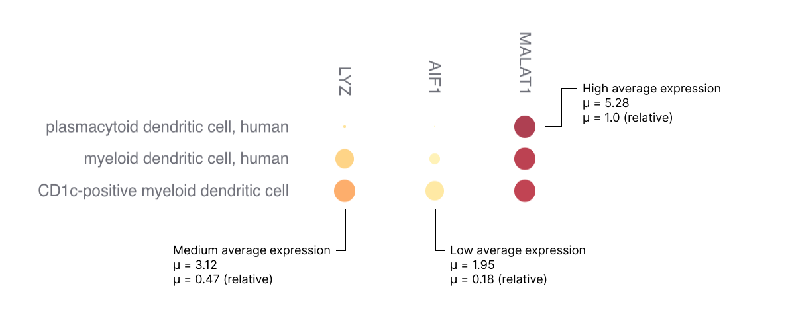
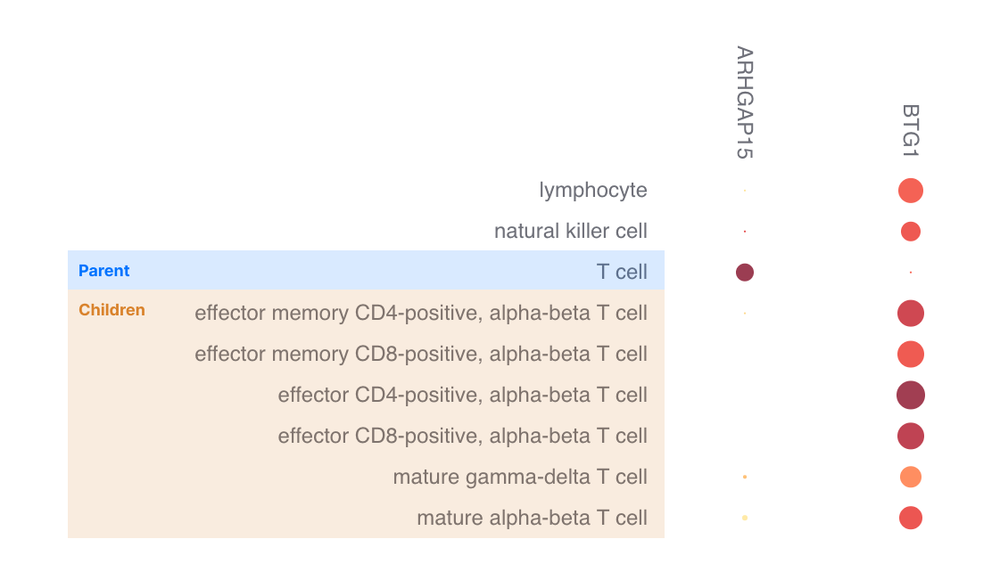
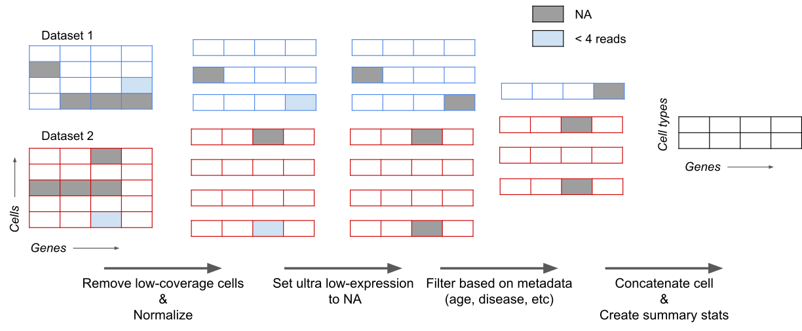
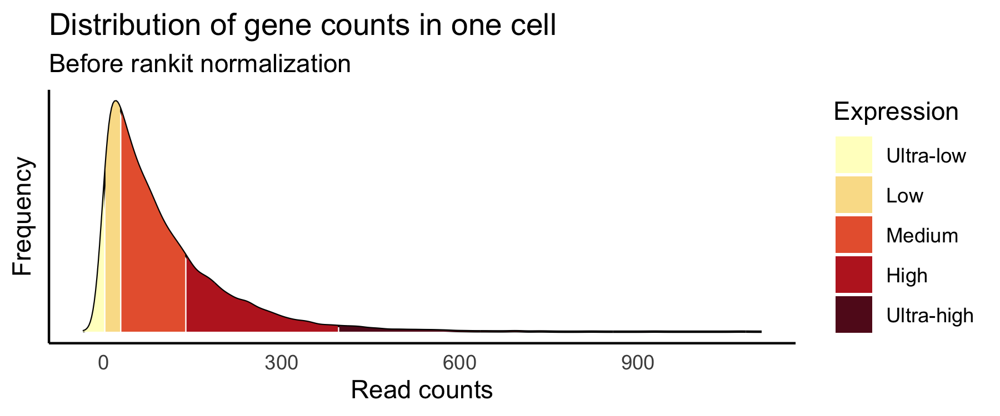
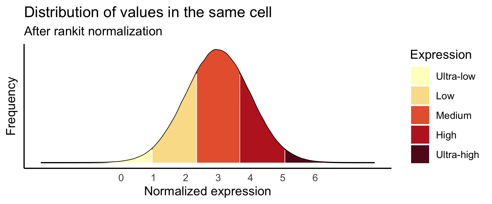

# scExpression documentation

## How to interpret a gene expression dot plot

### The dot plot basics

A dot plot can reveal gross differences in expression patterns across cell types and highlights genes that are moderately or highly expressed in certain cell types. 

Dot plots visualize two values across two dimensions: color and size (Figure 1). The color of the dot approximates average gene expression. Its size represents the percentage of cells within each cell type that expresses the gene.

    
     
    <b>Figure 1.</b> Two metrics are represented in gene expression dot plots, gene expression and percentage of expressing cells.
 

The combination of these metrics in a grid of genes by cell types allows to make qualitative assessments of gene expression (Figure 2).

Genes that are lowly expressed or expressed in a small percentage of cells are difficult to visually  identify in a dot plot. This is particularly important for certain marker genes that are specifically but lowly expressed in their target cell types, for example transcription factors and receptors.

 
	
     
    <b>Figure 2.</b> Types of possible qualitatively assessments in a dot plot. 
 

 
### How to make sense of normalized values

The data used to create the averages for the dot plot is quantile normalized  and it ranges from 0 to 6 ([see below](#Data-normalization) for details). Roughly, low expression has normalized values lower than 2, medium expression ranges from 2 to 4, and high expression is higher than 4 (Figure 3). These values are used for the dot plot color scheme and are constant and comparable across different dot plots. Additionally, the user has the ability to switch to a relative scale that maps the lowest and highest expression values in a dot plot to the min and max colors, thus providing a wider color range for what's shown in a dot plot. 

 
	
     
    <b>Figure 3.</b> Examples of high, medium and low expression. 
 

 
The examples in Figure 3 have a relatively constant percentage of cells expressing a gene (dot size), however to identify highly expressed genes the user is advised to pay attention to both the color intensity and the size of the dot. 

### How to navigate cell types

Cell types in the dot plot (rows) are ordered by default with an [algorithm](#Cell-type-ordering) that preserves relationships in the Cell Type ontology (CL). Thus cell types from the same lineage are roughly shown consecutively.

All cell types from a given tissue are shown as originally annotated in the dataset-of-origin. This leads to scenarios where parent and children cell types may be present in the dot plot, but they are independent observations and the former is not a superset of the latter (Figure 4).

 
	
     
    <b>Figure 4.</b> In some cases parent and children cell types are present, but these are independent of each other.
 

### Caveats of normalization

Given that data are [quantile normalized](#Data-normalization) all expression is relative to the cells it is measured in. As such comparisons of absolute expression across cell types could be made if the number of genes measured is equal across all cells. While this assumption is violated, we attempt to minimize negative effects by [excluding cells with low gene coverage](#Removal-of-low-coverage-cells) thus reducing the variance in the number of genes measured across cells. 

Nonetheless, caution is advised when finding subtle differences in the dot plot across cell types. 

Users interested in evaluating the pre-normalized absolute expression data can access it through our cell api (coming soon).

## Cell type ordering

Cell types are annotated by the original data contributors and mapped to the closest cell ontology (CL) term as defined in the [data schema](https://github.com/chanzuckerberg/single-cell-curation/blob/main/schema/2.0.0/schema.md#cell_type_ontology_term_id). 

In some cases there are cell types annotated with a high-level term whereas in some other cases they can be very granularly annotated. For example, there are some cells annotated as "T cells" and others annotated with children terms like "effector CD8-positive, alpha-beta T cell". All of these cell types are shown in the dot plot and they should not be interpreted as one being a subset of the other.

### Ontology-based ordering

Cell types are ordered according to the CL directed acyclic graph (DAG). Briefly, for each tissue a 2-dimensional representation of the DAG containing the tissue cell types is built, then an ordered list of cell types is created by traversing the DAG using a depth-first approach.  

This method groups cell types together based on their ontological relationships thus providing a loose lineage-based ordering.

An in-depth description of this method can be found [here](./cell-type-ontology-ordering.md).

## Processing of expression data

 

 	
 	<b>Figure 5. </b> Overview of processing steps from raw read counts to gene expression averages per cell type.
 

### Removal of duplicate cells

Some data at the cellxgene data portal is duplicated due to independent submissions, for example meta-analysis vs original data. All data submitted to the portal is curated to indicate whether any cell is the primary data. Only cells demarcated as primary data are included in the processing steps below.

### Removal of low coverage cells

Any cell that has less than 500 genes expressed is excluded, this filters out about 8% of all data and does not eliminate any cell type in its entirety . This filter enables more consistent quantile vectors used for the normalization step.

### Gene-length pre-normalization

 WARNING - The following process has not been implemented as the feature **currently only includes data that does not require gene-length normalization.**

In platforms that sequence full RNA molecules, such as Smart-seq, gene counts are directly correlated with gene length. To account for this, gene counts from these technologies are divided by the corresponding gene length prior to normalization.

For each gene in our reference files, length was calculated by creating non-overlapping meta-exons across all isoforms of a gene, and then adding up their length in base-pairs. 

### Data normalization

Read counts are normalized using a modification of the rankit method which is a variation of quantile normalization used for gene expression data (Bolstad BM et al., Evans C et al., The GTEx Consortium.).  

For a given cell in a count matrix, the read counts across genes are transformed to quantiles, then those quantiles are mapped to the corresponding values of a normal distribution with mean = 3 and variance = 1 (Figure 6). Normalized matrices from multiple datasets of the same tissue are concatenated along the gene axis.

 

    
 

 
  

    
     
    <b> Figure 6. </b> Visual representation of rankit normalization.
 

 
This method accounts for sequencing depth by scaling gene expression to the approximate range of 0 to 6. A high gene-cell value (>5)  indicates that the gene is amongst genes that are the highest expressed in that cell, and similarly a low value (<1) indicates that the gene is amongst the lowest expressed genes in that cell. 

Rankit normalization compresses highly expressed genes to the right tail of the standard normal distribution (see below), thus providing ideal values for using a color representation of gene expression and avoiding saturation that would otherwise be present.

##### Considerations 

Given that the normalization is a form of quantile normalization that uses a constant target distribution, there are a few important considerations while working with these values:

- These values transform the biological/technical variance of gene expression to a constant variance from a normal distribution. 
- It has been proven that quantile normalization reduces technical variance and to a lesser extent biological variance  (Abrams ZB et al.).
- Individual gene expression values can produce spurious differential gene expression analysis (Zhao Y et al.).
- This normalization is not designed to specifically account for batch effects, however the use of a constant target distribution mitigates batch effects when calculating average gene expression. This mitigation is stronger as the number of datasets per tissue increases. 

### Removal of noisy ultra-low expression values

After applying normalization, any gene/cell combination that had counts less or equal than 2 are set to missing data. This allows for removal of noise due to ultra-lowly expressed genes and provides a cleaner visualization.

### Summarization of data in dot plot

For each gene/cell type combination the following values are represented in the dot plot, either visually or in text upon hover.

* Gene expression (dot color) – the average rankit-normalized gene expression among genes that have non-zero values.
* Scaled gene expression (dot color) – scaled mean expression to the range [0,1]. Scaling is done by assigning the minimum value in the current view to 0 and the max is assigned to 1. 
* Expressing cells (dot size) – percentage of cells of the cell type expressing the gene, in parentheses is shown the absolute number of cells expressing the gene. These numbers are calculated after the following filters have been applied: "Removal of low coverage cells" and "Removal of noisy low expression values".

### References

1. Abrams ZB et al. A protocol to evaluate RNA sequencing normalization methods. BMC Bioinformatics. 2019. [PubMed](https://pubmed.ncbi.nlm.nih.gov/31861985/).
1. Bolstad BM et al. A comparison of normalization methods for high density oligonucleotide array data based on variance and bias. Bioinformatics. 2002. [PubMed](https://pubmed.ncbi.nlm.nih.gov/12538238/).
1. Evans C et al. Selecting between-sample RNA-Seq normalization methods from the perspective of their assumptions Ciaran. Briefings in Bioinformatics. 2018. [PubMed] (https://pubmed.ncbi.nlm.nih.gov/28334202/).
1. The GTEx Consortium. The GTEx Consortium atlas of genetic regulatory effects across human tissues. Science. 2020. [PubMed] (https://pubmed.ncbi.nlm.nih.gov/32913098/).
1. Zhao Y et al. How to do quantile normalization correctly for gene expression data analyses. Scientific Reports. 2020. [PubMed] (https://pubmed.ncbi.nlm.nih.gov/32968196/).

