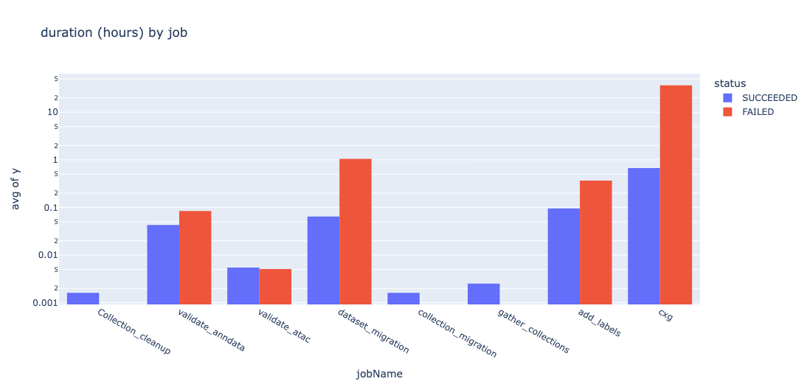

# Cxg Schema Migrations

A Cell-by-Gene migration is a procedure that occurs when a new cellxgene schema is available. The schemas are defined [here](https://github.com/chanzuckerberg/single-cell-curation/tree/main/schema). In brief, a schema expresses requirements and restrictions on the structure, format, value types and interpretation of all single-cell datasets the Cell-by-Gene corpus. The migration procedure creates a new dataset, compliant with the latest schema release, for every dataset in our corpus.

This project is aimed at CZI Data Service engineers who are tasked with performing and monitoring the migration process. It assumes you have access to and have read the internal document outlining the migration procedure. This project is meant to assist those engineers with additional context and tools to monitor and diagnose, in real-time, issues arising from migrations.

> :memo: **Note:** The migration process does issue a report with failures, but this is only available at the end of migration. Migration will take days.

## Pre-Requisites

- AWS profiles
  - `single-cell-dev` for development, rdev and staging environments
  - `single-cell-prod` for the production environment
- AWS CLI

> :memo: **Check:** Run the command below to confirm your CLI is configured

```bash
aws sts get-caller-identity --profile single-cell-dev
```

## Migration Environments

We perform a dry-run migration in the `dev` environment. The `dev` environment is a mirror of all the datasets available in `production` plus any additional datasets have been manually ingested into dev. For the remainder of this document, we assume `dev` is a 1:1 mirror of the data in `production`. The purpose of the `dev` migration is to catch, diagnose and squash all errors that arise during migration. Errors may arise from infrastructure issues or unanticipated migration logic issues.

Ultimately, the entire migration process must be applied to the `production` environment.

## Migration Procedure

The migration procedure consists of two stages (a) migration, and (b) ingestion.

The **migration stage** simply converts every dataset from the previous schema-version (i.e. 5.2.0) to the newest (i.e. 5.3.0) via a migration script. The migration script is tailor made by our team of curators and is available from the `cellxgene_schema` [Python package](https://pypi.org/project/cellxgene-schema/); pinned to the schema version to which it applies. The result is a dataset in our ecosystem, somewhere in storage.

The **ingestion stage** is responsible for bringing that migrated dataset into our registration ecosystem, persisted by a relational datase. It is the relational database that tracks and manages every dataset and their memership to both public and private collections. The same ingestion stage procedure handles both migrated datasets (ones that were previously in our corpus) and new datasets registered by our curators.

Both of these stages are encoded as state machines in AWS stepfunction service. These services and their codebase locations are listed in the table.

| stage     | step-function                        | python file                                   | entry point           |
| --------- | ------------------------------------ | --------------------------------------------- | --------------------- |
| migration | dp-dev-devstack-schema-migration-sfn | backend/layers/processing/schema_migration.py | SchemaMigrate.migrate |
| ingestion | dp-dev-devstack-sfn                  | backend/layers/processing/process.py          | ProcessMain.process   |

A simplified overview of these procedures are diagramed below:



## Monitoring an ongoing migration

Assume you have initiated a migration in the `dev` environment (i.e. `STAGE_NAME=dev`) that began on 3/21/2025 and is currently ongoing (let's say today is 3/23/2025). Let's walk through a few worfklows.

> **Note:** We currently don't tag a migration execution. Therefore we will use start times and end times to cull the relelvant jobs

> **Note:** The monitoring capabilities are dependent on both log and excution retention policy in the AWS account. When the information is deleted from AWS, the retroactive analysis is not possible.

### Setup your monitoring environment

Before actually performing any monitoring, we need to define the target of our monitoring. This includes the (i) environment, (ii) start date-time and (iii) end date-time.

```python
from datetime import datetime, timezone
from config import set_stage

# declare that we are looking in the development environment/stage
set_stage("dev") # use 'prod' if looking in production environment/stage

# declare start and end time
migration_start = datetime(2025,3, 21, 0, 0, 0, tzinfo=timezone.utc)
migration_end = datetime(2025, 3, 25, 11, 59, 59, tzinfo=timezone.utc) # or use `datetime.now()`, the migration is ongoing, remember ;)
```

### What is the status of the migration?

The migration step-function issues jobs to a job-queue as it executes each step. We can monitor progress by looking at the job data.

```python
from reporting.jobs import describe_migration_jobs

# convert jobs to a convenient dataframe for viewing
dfj = describe_migration_jobs(migration_start, migration_end)
```


You can view the job status-values graphically.

```python
from reporting.jobs import plot_job_status_counts
plot_job_status_counts(dfj)
```


### How long are these jobs taking?

Not all jobs take the same amount of time. We can use the data from the job descriptions dataframe `dfj` and plot the average duration broken down by job (and status).

```python
from reporting.jobs import plot_job_durations
plot_job_durations(dfj)
```



From this example, we can tell that the `cxg` jobs are taking a long time to complete. We can also see that successful jobs complete in around an hour, while failed jobs take over 20 hours on average.

### What kinds of validation errors are we seeing?

Now that we know some of the jobs are failing, it would be helpful if we can use the monitoring tools to inspect why the jobs are failing. Broadly, there are two families of issues; infrastructural issues, and runtime issues. The monitoring tools can help diagnose runtime issues, while we leave infrastructural issues for another time.

To get at the runtime issues, we would like to augment the job descriptions with log data. The log data will have all output from the logging system. This includes `INFO`, `WARNING`, and `ERROR` log-level messages.

> **NOTE:** This is a relatively expensive procedure, given the synchronous nature of the current implementation using boto3.

```python
from reporting.logs import merge_job_logs

# filter for 'FAILED' jobs
dff = dfj[dfj["status"]=="FAILED"]

# augment with logs
dff = merge_job_logs(dff)

# view logs results (for a single job)
dff.iloc[0]["logResults"]
```

> :construction: **TODO:** Filter for `ERROR` log-level messaages.

### Which datasets have completed migration?

So far, we have only looked at the status of individual jobs. However, the migration of a dataset involves multiple jobs. We may want to aggregate the job data up to the dataset level.

```python
from reporting.datasets import report_datasets

# aggregate job information by DATASET
dfds = report_datasets(dfj)
```

> :warning: **TODO:** this aggregation is imperfect as it relies on _DATASET_VERSION_ID_, which changes its value during the course of the ingestion stage. It can be improved by updating job/step definitions to include `DATASET_ID` for every job/step.

You can view the report as a simple bar chart.

```python
from reporting.datasets import plot_dataset_status_counts

# plot dataset counts by status
plot_dataset_status_counts(dfds)
```


### Compare execution durations between environments

In the process of running a migration, we noticed that some jobs that completed in `dev` failed in `prod`. We wanted to examine this phenomenon globally across two distinct migration runs. In this example, we'll use the `sfn` (step-functions) client.

> **NOTE:** step-function execution results are returned longer that job descriptions or job-logs. Additionally, the step-function execution for the `ingestion` phase tracks the progress of a single ingestion end-to-end.

In the following example, we'll imagine a situation where a single migration in `dev` occurred between 4/1/2025 and 4/5/2025, while a `prod` migration occurred between 4/6/2025 and 4/10/2025. We will also imagine that we care about two particular steps in the ingestion phase; `cxg` and `validate_anndata`

> :warning: **WARNING:** The step function execution query is relatively slow, as it is fetched one-per-execution, of which there are thousands. It can take upwards of 5 or 10 minutes.

```python
from config import get_sfn_name
from reporting.sfn import describe_sfn_executions, plot_job_duration_differences

# --------- DEV RESULTS -------------------------------------------
# dev migration parameters
set_stage("dev")
dev_start = datetime(2025, 4, 1, 0, 0, 0, tzinfo=timezone.utc)
dev_end = datetime(2025, 4, 5,  23, 59, 59, tzinfo=timezone.utc)

# get results (using step function client)
df_dev = describe_sfn_executions(get_sfn_name(), dev_start, dev_end)

# --------- PROD RESULTS -------------------------------------------
set_stage("prod")
prod_start = datetime(2025, 4, 6, 0, 0, 0, tzinfo=timezone.utc)
prod_end = datetime(2025, 4, 10,  23, 59, 59, tzinfo=timezone.utc)

# get results (using step function client)
df_prod = describe_sfn_executions(get_sfn_name(), prod_start, prod_end)

# --------- COMPARE -------------------------------------------------
# plot top 50 differentially long-running 'cxg' jobs
plot_job_duration_differences(df_dev, df_prod, "dev","prod", "cxg",count=50)

# plot top 50 differentially long-running 'validate_anndata' jobs
plot_job_duration_differences(df_dev, df_prod, "dev","prod", "validate_anndata",count=50)
```


> **NOTE:** DATASET_VERSION_ID is obscured for security reasons.

# Future Work

This monitoring project is in a very early stage of development. Currently, it helps save a bunch of clicks and it is easier to get a birds-eye view of ongoing (or recently completed) migrations. Some opportunities for improvement are:

## Passing _COLLECTION_ID_ and _DATASET_ID_ To All Jobs/Steps

Currently, the monitoring data only directly access information available to that execution's environment variables. In most cases, the environment variables contain values for `COLLECTION_VERSION_ID` and `DATASET_VERSION_ID`. However, these are insufficient. The `DATASET_VERSION_ID` refers to different things depending on the step/job that is running; sometimes it is the ID before the migration runs and sometimes it is the ID of the ongoing revision. This makes it **impossible** to collate the job data by the dataset on which it is operating. There is no cost to including the same collection/dataset identifiers throughout every step of the ingestion stage.

## AsyncIO Enbled Boto3 Queries

At this stage in development, only synchronous queries are supported i.e. loop through jobs --> fetch logs -> wait -> continue. We should wrap all io-bound operations with an asynchronous handler to issues io requests in parallel.

## Standardize Logger Messages for Easy Parsing

The cloudwatch jobs contain both (i) application logs, and (ii) runtime logs, since both are sent to `stdout` and `stderr`. Both sources produce differently structured messages, that are difficult to parse. Monitoring should filter for "application logs" (i.e. those issued by the `logging` module). Furthermore, we could process the `info` log-level events to track progress (especially for long-running tasks like `cxg` conversion) and the `error` log-level events to track and categorize errors.

## Handle Infrastructure Related Errors

Sometimes jobs/steps fail for reasons not having to do with runtime. For example, a job can run out of memory or a container can fail to be installed from a container registry. These, and others, are infrastructural errors. Ideally, we could differentiate them from execution errors and categorize based on common or re-occurring issues.

## Reconcile/Harmonize the monitoring via step-function and jobs

The `job` is the more grular unit of work, while `step-functions` organize work at a more semantically meaningful level. The monitoring tooling supports both, but they do not inter-operate very well.

## Add migration-run tag to step function execution metadata

Migration step-functions are not run in parallel, so we can group jobs that run in a particular migration attempt by knowing the start and end times. This is, however, rather fragile. A more robust solution is to tag each attempt with an environment variable that gets past to every job triggered in the step-fucntion. For example, we could label attempt-1 `{"MIGRATION_ATTEMPT": "ATTEMPT_1"}` and attempt-2 `{"MIGRATION_ATTEMPT": "ATTEMPT-2"}`. We could then support better culling of jobs/steps by the larger migration attempt to which it belongs.

```python
from reporting.jobs import describe_migration_jobs

# convert jobs to a convenient dataframe for viewing
# dfj = describe_migration_jobs(migration_start, migration_end) <-- instead of this...
dfj = describe_migration_jobs("ATTEMPT_1") # <-- ... use this
```

### Add COLLECTION and DATASET semantics to monitoring

Currently, the monitoring operates at the job/step granularity level. However, we are more often interested in the semantically meaningful 'collection' or 'dataset' level. This would enable additional semantics that are meaningful to project managers and curators e.g. "public/private" or "published/unpublished". Imagine the following:

```python
from reporting.collections import get_collection_status

# get status for all collections
df_collections = get_collections_status(visibility=None, curator=None)

# get status for a particular collection
df_collection_status = get_collection_status(collection_id=COLLECTION_ID)
```

### Make installable with a CLI

Currently, these tools are not packaged separately. They are part of the `single-cell-data-portal` repo. It would be nice the package was installable as a CLI from pip.

```bash
# install into a virtual environment
pip install cxgm

# use the CLI
cxgm descirbe jobs --env dev --tag ATTEMPT_1 --out df_attempt_1.csv
cxgm plot jobs --y count --x job_name --color status --env dev --tag ATTEMPT_1 --out plot_jobs.png
```
