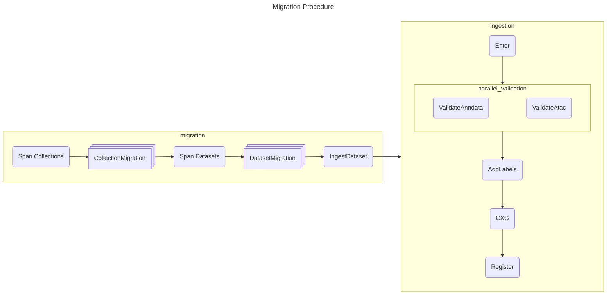

```mermaid
---
title: Migration Procedure
---
flowchart LR
    subgraph migration
        direction TB
        stp-span-col("Span Collections") --> stp-migrate-col@{shape: procs, label: "CollectionMigration"}
        stp-migrate-col --> stp-span-ds("Span Datasets")
        stp-span-ds --> stp-migrate-ds@{shape: procs, label: "DatasetMigration"}
        stp-migrate-ds --> stp-ingest-ds("IngestDataset")
    end

    subgraph ingestion
        direction TB
        stp-enter("Enter") --> parallel_validation
        subgraph parallel_validation
            direction LR
            stp-validate-ad("ValidateAnndata")
            stp-validate-atac("ValidateAtac")
            stp-validate-ad ~~~ stp-validate-atac
        end
        parallel_validation --> stp-addlabels("AddLabels")
        stp-addlabels --> stp-cxg("CXG")
        stp-cxg --> stp-register("Register")
    end
    stp-ingest-ds --> ingestion

```
